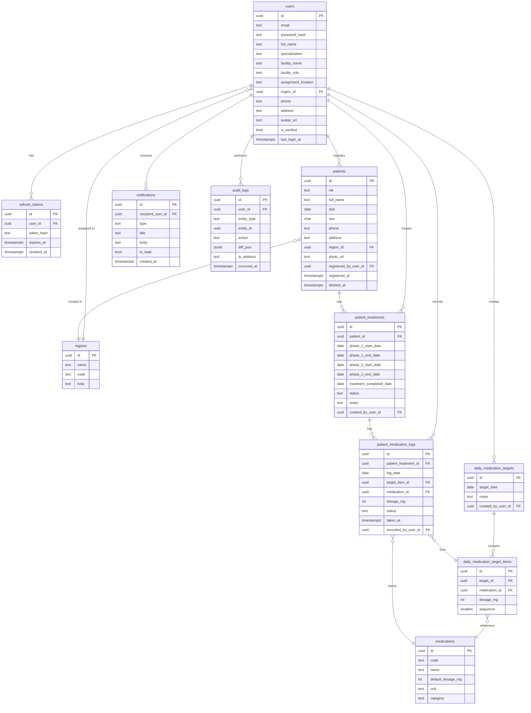

# TB Health Watch — Entity Relationship Diagram

```mermaid
erDiagram
    regions {
        uuid id PK
        text name
        text code
        text kota
    }
    medications {
        uuid id PK
        text code
        text name
        int default_dosage_mg
        text unit
        text category
    }
    users {
        uuid id PK
        text email
        text password_hash
        text full_name
        text specialization
        text facility_name
        text facility_role
        text assignment_location
        uuid region_id FK
        text phone
        text address
        text avatar_url
        bool is_verified
        timestamptz last_login_at
    }
    refresh_tokens {
        uuid id PK
        uuid user_id FK
        text token_hash
        timestamptz expires_at
        timestamptz revoked_at
    }
    patients {
        uuid id PK
        text nik
        text full_name
        date dob
        char sex
        text phone
        text address
        uuid region_id FK
        text photo_url
        uuid registered_by_user_id FK
        timestamptz registered_at
        timestamptz deleted_at
    }
    patient_treatments {
        uuid id PK
        uuid patient_id FK
        date phase_1_start_date
        date phase_1_end_date
        date phase_2_start_date
        date phase_2_end_date
        date treatment_completed_date
        text status
        text notes
        uuid created_by_user_id FK
    }
    daily_medication_targets {
        uuid id PK
        date target_date
        text notes
        uuid created_by_user_id FK
    }
    daily_medication_target_items {
        uuid id PK
        uuid target_id FK
        uuid medication_id FK
        int dosage_mg
        smallint sequence
    }
    patient_medication_logs {
        uuid id PK
        uuid patient_treatment_id FK
        date log_date
        uuid target_item_id FK
        uuid medication_id FK
        int dosage_mg
        text status
        timestamptz taken_at
        uuid recorded_by_user_id FK
    }
    notifications {
        uuid id PK
        uuid recipient_user_id FK
        text type
        text title
        text body
        bool is_read
        timestamptz created_at
    }
    audit_logs {
        uuid id PK
        uuid user_id FK
        text entity_type
        uuid entity_id
        text action
        jsonb diff_json
        text ip_address
        timestamptz occurred_at
    }

    users ||--o{ patients : "registers"
    users ||--o{ patient_treatments : "creates"
    users ||--o{ daily_medication_targets : "creates"
    users ||--o{ patient_medication_logs : "records"
    users ||--o{ notifications : "receives"
    users ||--o{ audit_logs : "performs"
    users ||--o{ refresh_tokens : "has"
    users }o--|| regions : "assigned to"
    patients }o--|| regions : "located in"
    patients ||--o{ patient_treatments : "has"
    patient_treatments ||--o{ patient_medication_logs : "has"
    daily_medication_targets ||--o{ daily_medication_target_items : "contains"
    daily_medication_target_items }o--|| medications : "references"
    patient_medication_logs }o--|| daily_medication_target_items : "from"
    patient_medication_logs }o--|| medications : "tracks"
```
